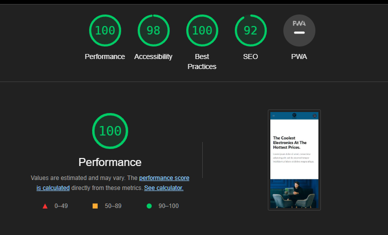

# Astro Shop

This is a simple bare-bones static e-commerce site I created to help me learn the [Astro](https://astro.build) framework.

Demo site: [https://astro-shop-jm.vercel.app/](https://astro-shop-jm.vercel.app/)
 

## About

Astro Shop is bare bones static e-commerce site built with Astro, React, Tailwind UI, and Typescript. It is not intended to be a fully functional e-commerce site, but rather a simple example of how to build a static e-commerce site with [Astro](https://astro.build). I plan on building a more fully featured e-commerce SSR site with Astro in the future.

### Setup

1. Clone the repo
2. Navigate to the project directory
3. Run `npm install`
4. Run `npm run dev`
5. Point your browser to `http://localhost:3000`

